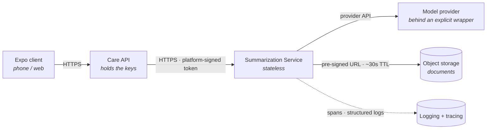
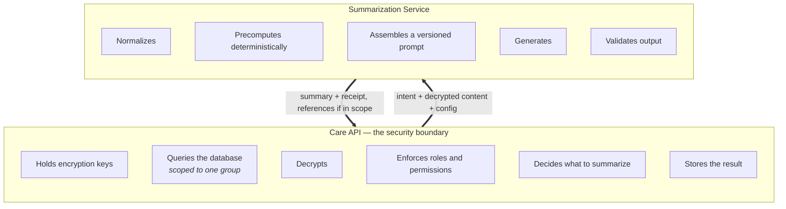
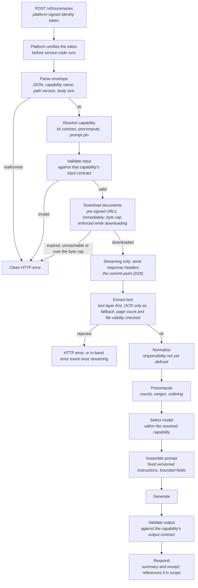
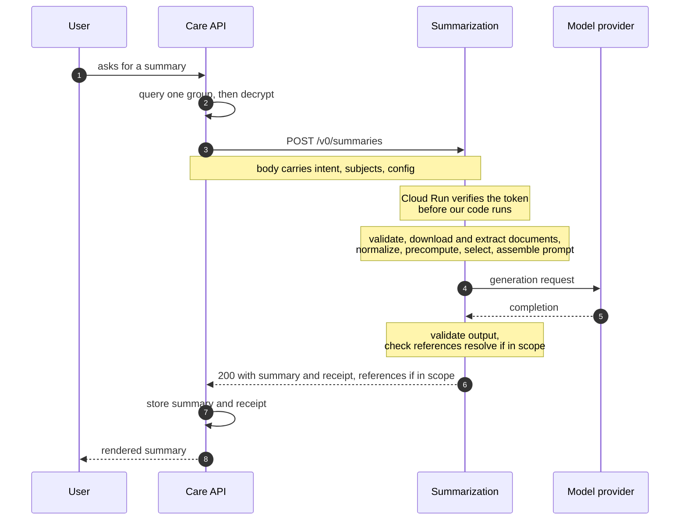
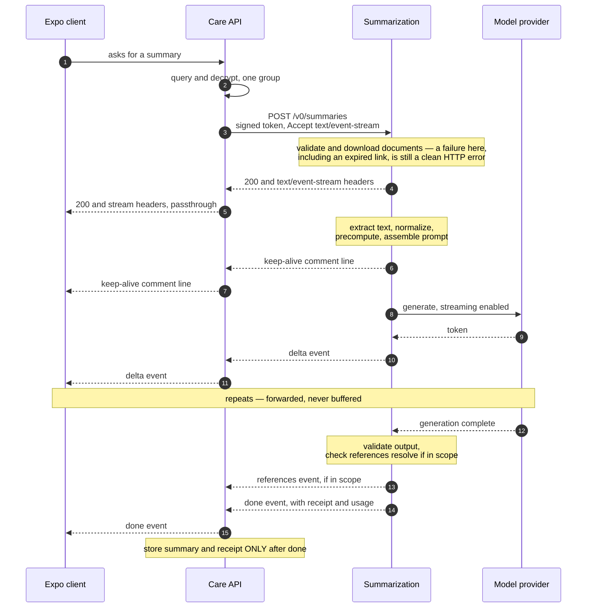
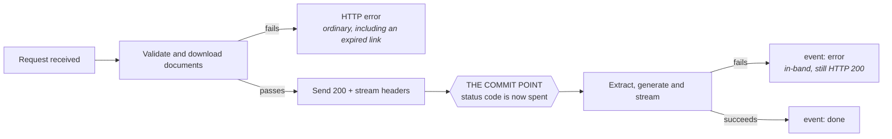
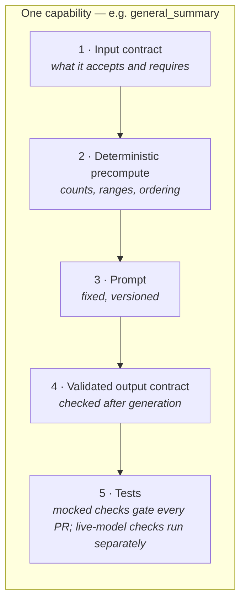

# Diagrams

The canonical diagram set for the service, drawn to match the settled design. A few small text
sketches also appear inline in [`architecture.md`](architecture.md); where they differ, this file is
authoritative.

Decisions referenced as **D*n*** are in [`decisions.md`](decisions.md); anything unsettled is in
[`open-questions.md`](open-questions.md). Where a diagram shows something not yet settled, it is
marked inline.

Diagrams are **Mermaid in Markdown**, not exported images — they render on GitHub and diff as text
in review, so a change to one is visible rather than buried in a binary. They can still fall out of
step with the prose; keeping them aligned is a review responsibility, not an automatic property.

**Contents**

1. [Topology — who connects to whom](#1-topology--who-connects-to-whom)
2. [Trust boundary](#2-trust-boundary)
3. [Request path inside the service](#3-request-path-inside-the-service)
4. [Round trip — synchronous (v0)](#4-round-trip--synchronous-v0)
5. [Round trip — streaming (v0.3)](#5-round-trip--streaming-v03)
6. [The commit point](#6-the-commit-point)
7. [Capability structure](#7-capability-structure)
8. [What these diagrams corrected](#8-what-these-diagrams-corrected)

---

## 1. Topology — who connects to whom

Four participants and the links between them. Nothing here is a second channel: every link is an
ordinary HTTPS connection.

| Link | Carries | Note |
|---|---|---|
| Client → Care API | The user's request | Outside this service's concern |
| Care API → Summarization | Intent, decrypted content, configuration | **The only inbound path in v0** (D17) |
| Summarization → Model provider | Prompt and completion | **Which provider is configuration, not architecture** — see below |
| Summarization → Trace destination | Spans, and **optionally sampled content** under D23 | A separate destination from the model provider, with its own eligibility and retention |
| Summarization → Object storage | Document fetch | Pre-signed, ~30s, **no IAM grant to us** (D9) |
| Summarization → Observability | Spans and logs | Content suppressed by default (D23) |

### The provider node is deliberately generic

Every diagram on this page says **"model provider"** rather than naming one. That is not vagueness —
it reflects D12: the provider sits behind a wrapper and is chosen by **explicit configuration, never
inferred**.

| Where | Provider today | Constraint |
|---|---|---|
| Production | Vertex AI | The only one currently inside the BAA boundary — this is what forces it, not preference |
| Local development | OpenRouter | **Outside** the BAA boundary, so **synthetic data only** |
| Anywhere else | Not yet decided | Which additional providers are permitted, and what qualifies one, is open — see [`open-questions.md`](open-questions.md) §2.6 |

A sibling service resolves providers with an `is_vertex` boolean. That shape expresses two routes to
**one** vendor and cannot express a third; D12 explicitly rules out inheriting it. Drawing "Vertex"
as a fixed node would re-introduce the same assumption visually.

**The client never talks to this service.** A direct path is deferred, and would arrive as a
separate public edge service rather than a second authentication mode on this one (D17).

---

## 2. Trust boundary

What each side owns. The single most important property of the design is where this line sits.

The service holds none of the caller's encryption keys, queries nothing, and evaluates no permission
(D2, D3). It receives
content and returns prose. See [`overview.md`](overview.md) §4 for why each exclusion is deliberate
rather than unfinished.

---

## 3. Request path inside the service

Five things here are easy to get wrong in an intuitive drawing:

- **The capability is resolved before anything capability-specific happens.** Validation and
  precompute both need that capability's own contract and code, so neither can come first. Model
  selection is separate and later, since it may depend on normalized data.
- **Precompute runs before the model.** Anything that must be correct — a count, a date range, an
  ordering — is computed, not requested (D16).
- **Output is validated after the model.** A prompt asking for a field does not guarantee the field.
- **Document limits are enforced as documents are processed, not on the request.** Real sizes, page
  counts and file validity are not knowable from URL metadata, and a caller-declared content type is
  not proof of file type. The byte cap stops a download partway through; page count and file validity
  are checked during extraction. Early rejection covers the envelope, the document count and the
  input contract.
- **In a streamed response, headers go out after the download** (D29). A dead or oversized link is
  still an ordinary HTTP error; extraction and everything after it fail in-band.

**The normalizer's responsibility is not defined.** The caller already maps its records into the one
declared request shape, so what the service's normalizer changes is open — see
[`open-questions.md`](open-questions.md) §2.8.

> **References are conditional.** Whether the response carries references back to source records is
> an open scope decision — see [`open-questions.md`](open-questions.md) §1.3.

## 4. Round trip — synchronous (v0)

**The caller stores the result, not us** (D8). The receipt travels with it — that is what identifies
the configuration behind a past summary (D18, D25). It is provenance: re-running the same request
would require the caller to have kept what it sent.

---

## 5. Round trip — streaming (v0.3)

**The one idea:** nothing opens a second channel. Server-sent events are the ordinary response body
of the POST already in flight, written a piece at a time instead of all at the end. "Starting the
stream" means sending response headers early and not closing the connection (D21).

**The wire format behind the labels.** The diagram says "delta event" where the stream actually
carries `event: delta`; "keep-alive comment line" is a line beginning with a colon, which parsers
ignore but intermediaries see as bytes — which is what stops them closing an idle connection. The
event names are `start`, `delta`, `references`, `done` and `error`. They are written plainly above
because a leading colon and unquoted braces both break Mermaid's sequence parser.

> **⚠ Not settled.** Whether references travel as their own event or inside `done`, and the event
> payloads generally, are part of the unsettled streaming wire contract — see
> [`interface.md`](interface.md) §1. The diagram shows one possible layout.

### Four things that have to be true

1. **Validation and document download happen before the headers** (D29). Once `200 OK` is sent you
   cannot return an error status. Send headers only after the request passes validation and its
   documents are downloaded, so schema errors and dead links stay ordinary HTTP errors; extraction,
   generation and output-validation failures are in-band.

2. **The Care API forwards chunk by chunk.** If it accumulates the stream and returns it whole, the
   user waits the full duration and the streaming work is wasted. This looks correct in tests and
   fails only in production.

3. **Nothing in the path may buffer.** Proxies and load balancers each have their own buffering
   settings, and every one of them must be checked.

4. **There must be an explicit terminal event.** Without `done`, a dropped connection and a finished
   one look identical to the client, so it cannot know whether the summary is safe to store.

### The cost, stated plainly

At `event: delta` the text is **not yet validated**. If reference checking fails at the end, the
user has already read several paragraphs and all that can be sent is `event: error`.

| Option | Result |
|---|---|
| Stream prose, validate at the end, finish with a terminal event carrying the receipt (and references, if in scope) | **The only one with real time-to-first-token.** Accepts that a stream can fail after the user has seen words |
| Validate, then send | Correct, but time-to-first-token becomes total latency — no benefit over synchronous |
| Stream into a buffer the client cannot render yet | Worst of both |

Every streaming model API pays this same price. The mitigation is the terminal-event rule: **display
freely, persist only on `done`.**

---

## 6. The commit point

The single most consequential moment in a streamed response.

**Before the commit point**, a failure is a clean status code the caller can branch on. **After it**,
the response is already `200` and every failure is an event inside a successful HTTP response.

This is not a quirk to work around — it is a property of streaming over HTTP, and it has to be in
the contract rather than discovered by the first caller to hit it.

---

## 7. Capability structure

A capability is a five-part specification, not a prompt (D16).

The principle behind the split: **asking a model for a required detail does not produce it.**
Anything that must be present is computed before the call or validated after it — never left to the
prompt and hoped for.

See [`capabilities.md`](capabilities.md) for how one is built and how prompts are versioned.

---

## 8. What these diagrams corrected

These consolidate three earlier local drafts. Those drafts were drawn while the design was moving,
and several of their assumptions have since been settled differently. Recorded here so a reader who
saw an earlier version knows what changed, and why this file supersedes them.

| Earlier drawing showed | Now | Settled by |
|---|---|---|
| `POST /summarize` | `POST /v0/summaries` — the path pins schema compatibility | D18 |
| A free-text `purpose` string | A named intent from a published catalogue | D10 |
| `content` grouped by data type, flat item lists | `subjects[]` array, opaque `subject_id`, per-topic `state` | D19 |
| An app-side classifier resolving intent | Classification is caller-side and narrow; routing here is a **lookup, never a classifier** | D10 |
| No precompute step | Deterministic precompute before the model call | D16 |
| **No output validation step** | Output validated against the capability's contract | D16 |
| "Model router — tier selection" | Capability and model selection, 1:1 in phase 1 | D4 |
| No authentication shown | Cloud Run IAM with a Google-signed OIDC token, verified before our code runs | D17 |
| No documents | Pre-signed URLs, fetched immediately; text layer first, OCR as fallback | D9, D20 |
| Response = "summary + metadata" | Summary + **generation receipt**, plus **references** if in scope | D18 |
| Synchronous only | Synchronous in v0; SSE over the same POST from v0.3 | D21 |

**One thing the earlier drafts got right and is worth keeping:** the classifier and the router are
different things sitting on opposite sides of the boundary. The classifier resolves *what the user
means and what data that needs*; the router picks *which model runs*. Conflating them is what made
that discussion circle.

### Still not settled in any diagram above

- **The request body shape** — §4 notes the body carrying intent, subjects and config, which is the
  direction, not the contract. See [`open-questions.md`](open-questions.md) §1.4.
- **Traceability** — §4 and §5 show references being checked, marked *if in scope*: whether v0.1
  includes references back to source items at all is open, and it is an epic requirement. See
  [`open-questions.md`](open-questions.md) §1.3.
- **What the normalizer does** — §3 and §2 show a normalize step whose responsibility is not defined.
  See [`open-questions.md`](open-questions.md) §2.8.
- **Chunking for large inputs** — no diagram shows pre-summarization or chunking. A single
  generation call is assumed throughout, which will not hold for large document sets.
