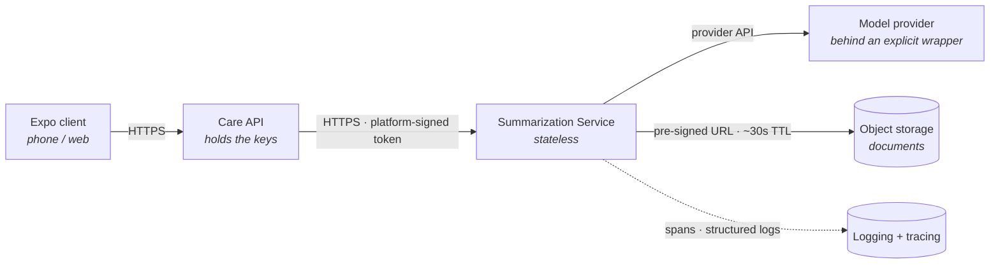

## 1. Topology — who connects to whom

Four participants and the links between them. Nothing here is a second channel: every link is an
ordinary HTTPS connection.

| Link | Carries | Note |
|---|---|---|
| Client → Care API | The user's request | Outside this service's concern |
| Care API → Summarization | Intent, decrypted content, configuration | **The only inbound path in v0** (D17) |
| Summarization → Model provider | Prompt and completion | **Which provider is configuration, not architecture** — see below |
| Summarization → Trace destination | Spans, and **optionally sampled content** under D23 | A separate destination from the model provider, with its own eligibility and retention |
| Summarization → Object storage | Document fetch | Pre-signed, ~30s, **no IAM grant to us** (D9) |
| Summarization → Observability | Spans and logs | Content suppressed by default (D23) |

